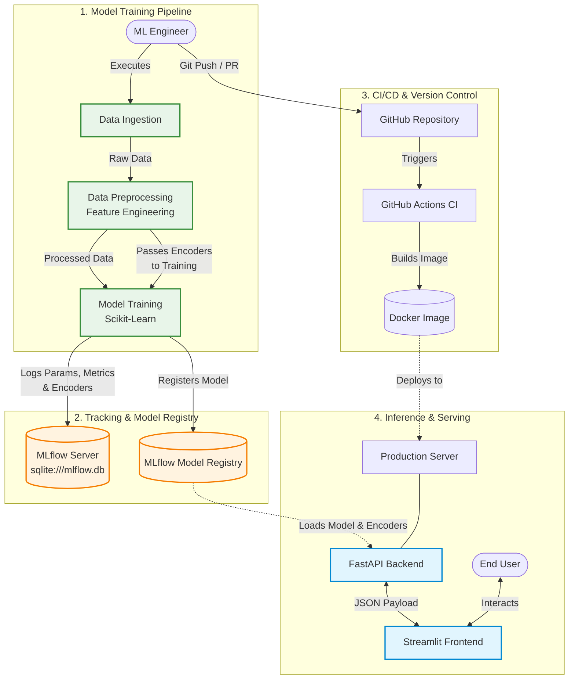

# 🏗️ System & MLOps Architecture

This document outlines the architecture of the **User Purchase Prediction** project. The system is designed following modern **MLOps (Machine Learning Operations)** best practices, ensuring clear separation of concerns between model training, tracking, deployment, and serving.

---

## 📊 High-Level Architecture Diagram

---

## ⚙️ Component Breakdown

### 1. Model Training Pipeline (`src/`)
This is the core data science pipeline responsible for creating the model.
- **Data Ingestion:** Reads the raw dataset (`Data/`) and performs initial validation.
- **Preprocessing:** Handles missing values, performs `LabelEncoding`, and maps categorical IDs using `Frequency Encoding`. 
- **Model Training:** Fits the machine learning algorithms to the processed data.

### 2. Tracking & Model Registry (`mlflow.db` & `mlruns/`)
Ensures absolute reproducibility and strict versioning of the machine learning models.
- **MLflow Tracking:** Backed by a local SQLite database (`mlflow.db`), it logs all experiment parameters, evaluation metrics (like MAE, MSE, R2), and training timestamps.
- **Model Registry:** The finalized XGBoost model is formally registered under the name `UserPurchasePredictionModel`. Crucially, the **data encoders** (`le_city.pkl`, `le_gender.pkl`, `product_freq.pkl`) are logged as MLflow artifacts alongside the registered model, ensuring that the exact transformations used during training are perfectly coupled with the inference model to prevent feature mismatch.

### 3. CI/CD & Version Control (`.github/workflows/`)
Automates the software engineering aspects of the ML lifecycle.
- Every push to the `main` branch triggers **GitHub Actions**, which automatically builds the project into an isolated **Docker Image**. 
- This guarantees that the code running on the developer's laptop behaves identically in production.

### 4. Inference & Serving (`app.py` & `main.py`)
The production applications that serve the model to end-users.
- **FastAPI:** Acts as the high-performance inference engine. It loads the artifacts in memory and exposes a RESTful endpoint (`/predict`).
- **Streamlit:** A clean, user-friendly frontend that gathers user input, formats it as JSON, and queries the FastAPI backend.
